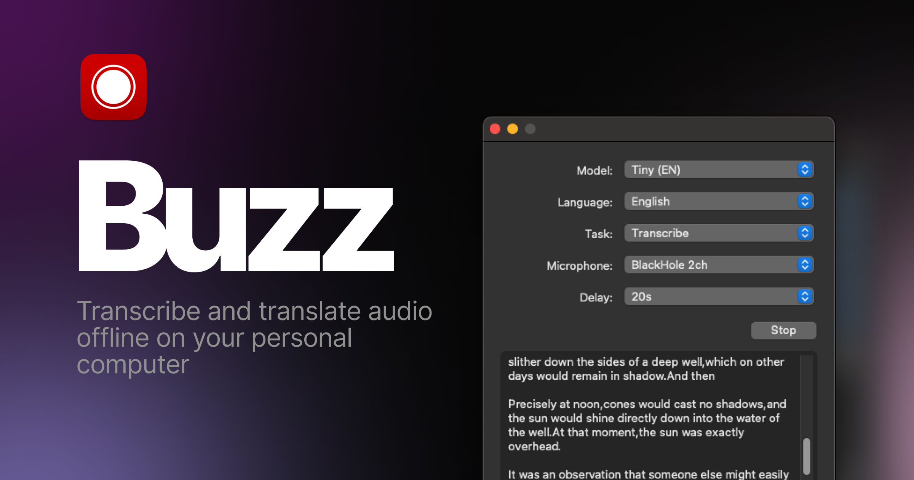
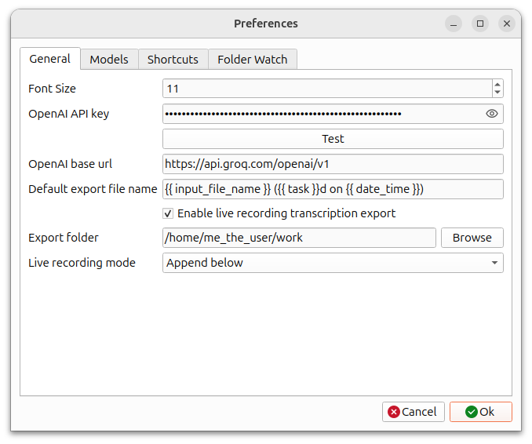
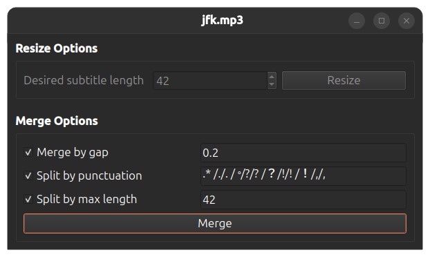

# Buzz

[ドキュメント](https://chidiwilliams.github.io/buzz/)

パソコン上でオフラインで音声の文字起こしと翻訳を行います。OpenAIの[Whisper](https://github.com/openai/whisper)を使用しています。


[](https://github.com/chidiwilliams/buzz/actions/workflows/ci.yml)
[](https://codecov.io/github/chidiwilliams/buzz)

[](https://GitHub.com/chidiwilliams/buzz/releases/)



## 機能
- 音声・動画ファイルまたはYouTubeリンクの文字起こし
- マイクからのリアルタイム音声文字起こし
  - イベントやプレゼンテーション中に便利なプレゼンテーションウィンドウ
- ノイズの多い音声でより高い精度を得るための、文字起こし前の話者分離
- 文字起こしメディアでの話者識別
- 複数のWhisperバックエンドをサポート
  - Nvidia GPU向けCUDAアクセラレーション対応
  - Mac向けApple Silicon対応
  - Whisper.cppでのVulkanアクセラレーション対応（統合GPUを含むほとんどのGPUで利用可能）
- TXT、SRT、VTT形式での文字起こしエクスポート
- 検索、再生コントロール、速度調整機能を備えた高度な文字起こしビューア
- 効率的なナビゲーションのためのキーボードショートカット
- 新しいファイルの自動文字起こしのための監視フォルダ
- スクリプトや自動化のためのコマンドラインインターフェース

## インストール

### macOS

[SourceForge](https://sourceforge.net/projects/buzz-captions/files/)から`.dmg`ファイルをダウンロードしてください。

### Windows

[SourceForge](https://sourceforge.net/projects/buzz-captions/files/)からインストールファイルを入手してください。

アプリは署名されていないため、インストール時に警告が表示されます。`詳細情報` -> `実行`を選択してください。

### Linux

Buzzは[Flatpak](https://flathub.org/apps/io.github.chidiwilliams.Buzz)または[Snap](https://snapcraft.io/buzz)として利用可能です。

Flatpakをインストールするには、以下を実行してください：
```shell
flatpak install flathub io.github.chidiwilliams.Buzz
```

[](https://flathub.org/en/apps/io.github.chidiwilliams.Buzz)

Snapをインストールするには、以下を実行してください：
```shell
sudo apt-get install libportaudio2 libcanberra-gtk-module libcanberra-gtk3-module
sudo snap install buzz
```

[](https://snapcraft.io/buzz)

### PyPI

[ffmpeg](https://www.ffmpeg.org/download.html)をインストールしてください。

Python 3.12環境を使用していることを確認してください。

Buzzをインストール

```shell
pip install buzz-captions
python -m buzz
```

**PyPIでのGPUサポート**

PyPIでインストールしたバージョンでWindows上のNvidia GPUのGPUサポートを有効にするには、[torch](https://pytorch.org/get-started/locally/)のCUDAサポートを確認してください。

```
pip3 install -U torch==2.8.0+cu129 torchaudio==2.8.0+cu129 --index-url https://download.pytorch.org/whl/cu129
pip3 install nvidia-cublas-cu12==12.9.1.4 nvidia-cuda-cupti-cu12==12.9.79 nvidia-cuda-runtime-cu12==12.9.79 --extra-index-url https://pypi.ngc.nvidia.com
```

### 最新開発版

最新の機能やバグ修正を含む最新開発版の入手方法については、[FAQ](https://chidiwilliams.github.io/buzz/docs/faq#9-where-can-i-get-latest-development-version)をご覧ください。

### スクリーンショット

<div style="display: flex; flex-wrap: wrap;">
    
    
    
    
    
    
    
</div>
