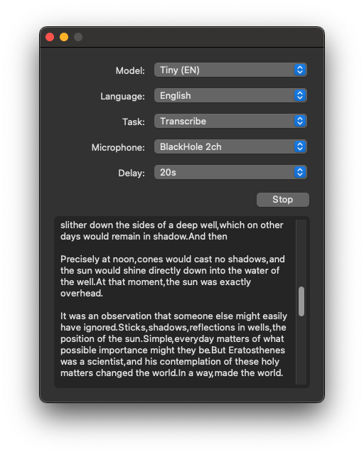

# Buzz

> Transcribe and translate audio offline on your personal computer.




[](https://github.com/chidiwilliams/buzz/actions/workflows/ci.yml)


## Features

- Real-time transcription and translation from your computer's microphones to text
- Import audio and video files and export to TXT, SRT, and VTT

Buzz transcribes audio from your computer's microphones to text in real-time using OpenAI's [Whisper](https://github.com/openai/whisper).

<a href="https://www.loom.com/share/564b753eb4d44b55b985b8abd26b55f7">
  <p>Buzz - Watch Video</p>
  
</a>

## Requirements

To set up Buzz, first install ffmpeg ([needed to run Whisper](https://github.com/openai/whisper#setup)).

```text
# on Ubuntu or Debian
sudo apt update && sudo apt install ffmpeg

# on MacOS using Homebrew (https://brew.sh/)
brew install ffmpeg

# on Windows using Chocolatey (https://chocolatey.org/)
choco install ffmpeg

# on Windows using Scoop (https://scoop.sh/)
scoop install ffmpeg
```

## Installation

To install Buzz, download the [latest version](https://github.com/chidiwilliams/buzz/releases/latest) for your operating system. Buzz is available on Mac (Intel), Windows, and Linux.

### Mac (Intel)

- Download and open the `*-mac.dmg` file.
- After the installation window opens, drag the Buzz icon into the folder to add Buzz to your Applications directory.

### Windows

- Download and extract the `*-windows.tar.gz` file.
- Open the Buzz.exe file

### Linux

- Download and extract the `*-unix.tar.gz` file.
- Open the Buzz binary file.

## How to use

To record from a system microphone, select a model, language, task, microphone, and delay, then click Record.

**Model**: Default: Tiny.

**Language**: Default: English.

**Task**: Transcribe/Translate. Default: Transcribe.

**Microphone**: Default: System default microphone.

**Delay**: The length of time (in seconds) Buzz waits before transcribing a new batch of recorded audio. Increasing this value will make Buzz take longer to show new transcribed text. However, shorter delays cut the audio into smaller chunks which may reduce the accuracy of the transcription. Default: 10s.

For more information about the available model types, languages, and tasks, see the [Whisper docs](https://github.com/openai/whisper).

### Record audio playing from computer

To record audio playing out from your computer, you'll need to install an audio loopback driver (a program that lets you create virtual audio devices). The rest of this guide will use [BlackHole](https://github.com/ExistentialAudio/BlackHole) on Mac, but you can use other alternatives for your operating system (see [LoopBeAudio](https://nerds.de/en/loopbeaudio.html), [LoopBack](https://rogueamoeba.com/loopback/), and [Virtual Audio Cable](https://vac.muzychenko.net/en/)).

1. Install [BlackHole via Homebrew](https://github.com/ExistentialAudio/BlackHole#option-2-install-via-homebrew)

   ```shell
   brew install blackhole-2ch
   ```

2. Open Audio MIDI Setup from Spotlight or from `/Applications/Utilities/Audio Midi Setup.app`.

   

3. Click the '+' icon at the lower left corner and select 'Create Multi-Output Device'.

   

4. Add your default speaker and BlackHole to the multi-output device.

   

5. Select this multi-output device as your speaker (application or system-wide) to play audio into BlackHole.

6. Open Buzz, select BlackHole as your microphone, and record as before to see transcriptions from the audio playing through BlackHole.

## Build/run locally

To build/run Buzz locally from source, first install the dependencies:

1. Install [Poetry](https://python-poetry.org/docs/#installing-with-the-official-installer).
2. Install the project dependencies.

   ```shell
   poetry install
   ```

Then, to run:

```shell
poetry run python main.py
```

To build:

```shell
poetry run pyinstaller --noconfirm Buzz.spec
```
