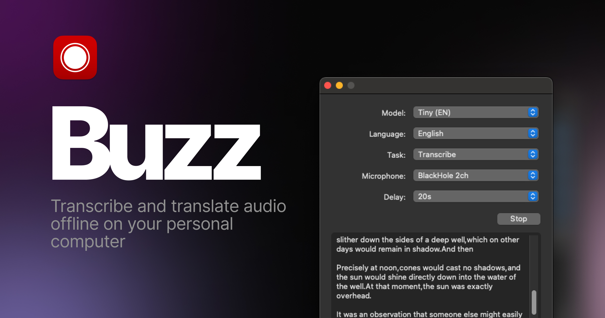

# Buzz

[Documentation](https://chidiwilliams.github.io/buzz/) | [Buzz Captions on the App Store](https://apps.apple.com/us/app/buzz-captions/id6446018936?mt=12&itsct=apps_box_badge&itscg=30200)

Transcribe and translate audio offline on your personal computer. Powered by
OpenAI's [Whisper](https://github.com/openai/whisper).


[](https://github.com/chidiwilliams/buzz/actions/workflows/ci.yml)
[](https://codecov.io/github/chidiwilliams/buzz)

[](https://GitHub.com/chidiwilliams/buzz/releases/)

<blockquote>
<p>Buzz is better on the App Store. Get a Mac-native version of Buzz with a cleaner look, audio playback, drag-and-drop import, transcript editing, search, and much more.</p>
<a href="https://apps.apple.com/us/app/buzz-captions/id6446018936?mt=12&amp;itsct=apps_box_badge&amp;itscg=30200"></a>
</blockquote>



## Installation

**macOS**:

```shell
brew install --cask buzz
```

**Windows**:

Download and run the `.exe` file in the [releases page](https://github.com/chidiwilliams/buzz/releases/latest).

**Linux**:

```shell
sudo apt-get install libportaudio2
sudo snap install buzz
```
