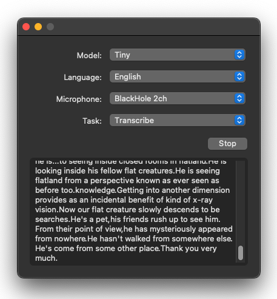

# Buzz




[](https://github.com/chidiwilliams/buzz/actions/workflows/ci.yml)

Buzz transcribes audio from your computer's microphones to text using OpenAI's [Whisper](https://github.com/openai/whisper).

## Requirements

To set up Buzz, first install ffmpeg ([needed to run Whisper](https://github.com/openai/whisper#setup)).

```text
# on Ubuntu or Debian
sudo apt update && sudo apt install ffmpeg

# on MacOS using Homebrew (https://brew.sh/)
brew install ffmpeg

# on Windows using Chocolatey (https://chocolatey.org/)
choco install ffmpeg

# on Windows using Scoop (https://scoop.sh/)
scoop install ffmpeg
```

## How to use

To record from a system microphone, select a model, language, microphone, and task, then click Record.

See the [Whisper docs](https://github.com/openai/whisper) for more information about the model types, languages, and tasks.

### Record audio playing from computer

To record audio playing out from your computer, you'll need to install an audio loopback driver (a program that lets you create virtual audio devices). The rest of this guide will use [BlackHole](https://github.com/ExistentialAudio/BlackHole) on Mac, but you can use other alternatives for your operating system (see [LoopBeAudio](https://nerds.de/en/loopbeaudio.html), [LoopBack](https://rogueamoeba.com/loopback/), and [Virtual Audio Cable](https://vac.muzychenko.net/en/)).

1. Install [BlackHole via Homebrew](https://github.com/ExistentialAudio/BlackHole#option-2-install-via-homebrew)

```shell
brew install blackhole-2ch
```

2. Open Audio MIDI Setup from Spotlight or from `/Applications/Utilities/Audio Midi Setup.app`.


3. Click the '+' icon at the lower left corner and select 'Create Multi-Output Device'.


4. Add your default speaker and BlackHole to the multi-output device.


5. Select this multi-output device as your speaker (application or system-wide) to play audio into BlackHole.

6. Open Buzz, select BlackHole as your microphone, and record as before to see transcriptions from the audio playing through BlackHole.

## Build

To build Buzz, install the dependencies:

```shell
# using pip
pip install .

# using poetry
poetry install
```

Then run:

```shell
make buzz
```
