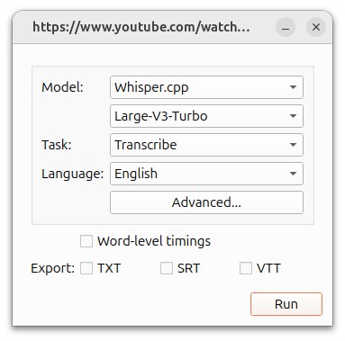
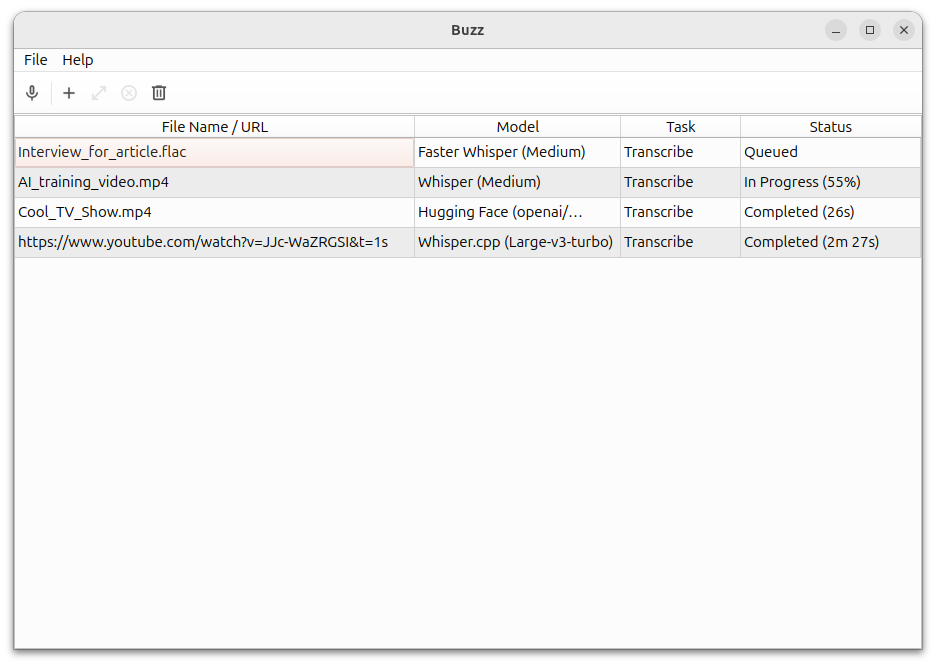
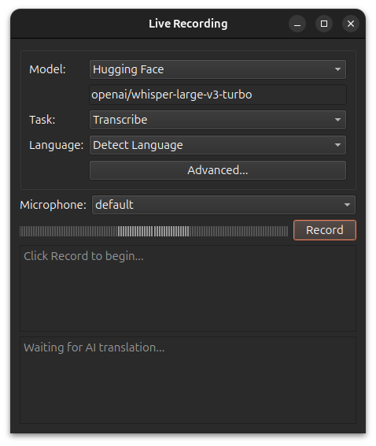

[[简体中文](readme/README.zh_CN.md)] <- 点击查看中文页面。

# Buzz

[Documentation](https://chidiwilliams.github.io/buzz/)

Transcribe and translate audio offline on your personal computer. Powered by
OpenAI's [Whisper](https://github.com/openai/whisper).


[](https://github.com/chidiwilliams/buzz/actions/workflows/ci.yml)
[](https://codecov.io/github/chidiwilliams/buzz)

[](https://GitHub.com/chidiwilliams/buzz/releases/)


## Features
- Transcribe audio and video files or Youtube links
- Live realtime audio transcription from microphone
  - Presentation window for easy accessibility during events and presentations
- Speech separation before transcription for better accuracy on noisy audio
- Speaker identification in transcribed media
- Multiple whisper backend support
  - CUDA acceleration support for Nvidia GPUs
  - Apple Silicon support for Macs
  - Vulkan acceleration support for Whisper.cpp on most GPUs, including integrated GPUs
- Export transcripts to TXT, SRT, and VTT
- Advanced Transcription Viewer with search, playback controls, and speed adjustment
- Keyboard shortcuts for efficient navigation
- Watch folder for automatic transcription of new files
- Command-Line Interface for scripting and automation

## Installation

### macOS

Download the `.dmg` from the [SourceForge](https://sourceforge.net/projects/buzz-captions/files/).

### Windows

Get the installation files from the [SourceForge](https://sourceforge.net/projects/buzz-captions/files/).

App is not signed, you will get a warning when you install it. Select `More info` -> `Run anyway`.

**Alternatively, install with [winget](https://learn.microsoft.com/en-us/windows/package-manager/winget/)**

```shell
winget install ChidiWilliams.Buzz
```

### Linux

Buzz is available as a [Flatpak](https://flathub.org/apps/io.github.chidiwilliams.Buzz) or a [Snap](https://snapcraft.io/buzz). 

To install flatpak, run:
```shell
flatpak install flathub io.github.chidiwilliams.Buzz
```

[](https://flathub.org/en/apps/io.github.chidiwilliams.Buzz)

To install snap, run:
```shell
sudo apt-get install libportaudio2 libcanberra-gtk-module libcanberra-gtk3-module
sudo snap install buzz
```

[](https://snapcraft.io/buzz)

### PyPI

Install [ffmpeg](https://www.ffmpeg.org/download.html)

Ensure you use Python 3.12 environment.

Install Buzz

```shell
pip install buzz-captions
python -m buzz
```

**GPU support for PyPI**

To have GPU support for Nvidia GPUS on Windows, for PyPI installed version ensure, CUDA support for [torch](https://pytorch.org/get-started/locally/) 

```
pip3 install -U torch==2.8.0+cu129 torchaudio==2.8.0+cu129 --index-url https://download.pytorch.org/whl/cu129
pip3 install nvidia-cublas-cu12==12.9.1.4 nvidia-cuda-cupti-cu12==12.9.79 nvidia-cuda-runtime-cu12==12.9.79 --extra-index-url https://pypi.ngc.nvidia.com
```

### Latest development version

For info on how to get latest development version with latest features and bug fixes see [FAQ](https://chidiwilliams.github.io/buzz/docs/faq#9-where-can-i-get-latest-development-version).

### Screenshots

<div style="display: flex; flex-wrap: wrap;">
    
    
    
    
    
    
    
</div>

