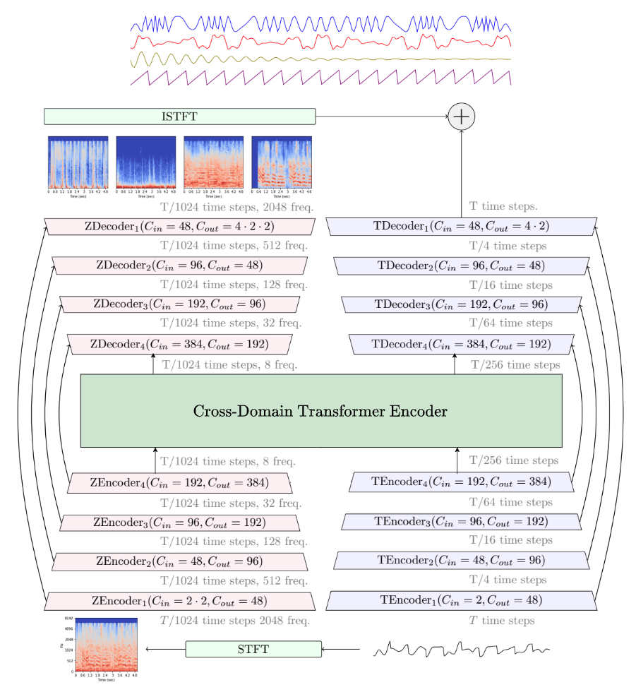

# Demucs Music Source Separation


**This is the officially maintained Demucs** now that I (Alexandre Défossez) have left Meta to join [Kyutai](https://twitter.com/kyutai_labs).
Note that I'm not actively working on Demucs anymore, so expect slow replies and no new feature for now.


This is the 4th release of Demucs (v4), featuring Hybrid Transformer based source separation.
**For the classic Hybrid Demucs (v3):** [Go this commit][demucs_v3].
If you are experiencing issues and want the old Demucs back, please file an issue, and then you can get back to Demucs v3 with
`git checkout v3`. You can also go [Demucs v2][demucs_v2].


Demucs is a state-of-the-art music source separation model, currently capable of separating
drums, bass, and vocals from the rest of the accompaniment.
Demucs is based on a U-Net convolutional architecture inspired by [Wave-U-Net][waveunet].
The v4 version features [Hybrid Transformer Demucs][htdemucs], a hybrid spectrogram/waveform separation model using Transformers.
It is based on [Hybrid Demucs][hybrid_paper] (also provided in this repo), with the innermost layers
replaced by a cross-domain Transformer Encoder. This Transformer uses self-attention within each domain,
and cross-attention across domains.
The model achieves a SDR of 9.00 dB on the MUSDB HQ test set. Moreover, when using sparse attention
kernels to extend its receptive field and per source fine-tuning, we achieve state-of-the-art 9.20 dB of SDR.

Samples are available [on our sample page](https://ai.honu.io/papers/htdemucs/index.html).
Checkout [our paper][htdemucs] for more information.
It has been trained on the [MUSDB HQ][musdb] dataset + an extra training dataset of 800 songs.
This model separates drums, bass and vocals and other stems for any song.


As Hybrid Transformer Demucs is brand new, it is not activated by default, you can activate it in the usual
commands described hereafter with `-n htdemucs_ft`.
The single, non fine-tuned model is provided as `-n htdemucs`, and the retrained baseline
as `-n hdemucs_mmi`. The Sparse Hybrid Transformer model decribed in our paper is not provided as its
requires custom CUDA code that is not ready for release yet.
We are also releasing an experimental 6 sources model, that adds a `guitar` and `piano` source.
Quick testing seems to show okay quality for `guitar`, but a lot of bleeding and artifacts for the `piano` source.


<p align="center">
</p>


## Important news if you are already using Demucs

See the [release notes](./docs/release.md) for more details.

- 22/02/2023: added support for the [SDX 2023 Challenge](https://www.aicrowd.com/challenges/sound-demixing-challenge-2023),
    see the dedicated [doc page](./docs/sdx23.md)
- 07/12/2022: Demucs v4 now on PyPI. **htdemucs** model now used by default. Also releasing
    a 6 sources models (adding `guitar` and `piano`, although the latter doesn't work so well at the moment).
- 16/11/2022: Added the new **Hybrid Transformer Demucs v4** models.
	Adding support for the [torchaudio implementation of HDemucs](https://pytorch.org/audio/stable/tutorials/hybrid_demucs_tutorial.html).
- 30/08/2022: added reproducibility and ablation grids, along with an updated version of the paper.
- 17/08/2022: Releasing v3.0.5: Set split segment length to reduce memory. Compatible with pyTorch 1.12.
- 24/02/2022: Releasing v3.0.4: split into two stems (i.e. karaoke mode).
    Export as float32 or int24.
- 17/12/2021: Releasing v3.0.3: bug fixes  (thanks @keunwoochoi), memory drastically
    reduced on GPU (thanks @famzah) and new multi-core evaluation on CPU (`-j` flag).
- 12/11/2021: Releasing **Demucs v3** with hybrid domain separation. Strong improvements
	on all sources. This is the model that won Sony MDX challenge.
- 11/05/2021: Adding support for MusDB-HQ and arbitrary wav set, for the MDX challenge. For more information
on joining the challenge with Demucs see [the Demucs MDX instructions](docs/mdx.md)


## Comparison with other models

We provide hereafter a summary of the different metrics presented in the paper.
You can also compare Hybrid Demucs (v3), [KUIELAB-MDX-Net][kuielab], [Spleeter][spleeter], Open-Unmix, Demucs (v1), and Conv-Tasnet on one of my favorite
songs on my [soundcloud playlist][soundcloud].

### Comparison of accuracy

`Overall SDR` is the mean of the SDR for each of the 4 sources, `MOS Quality` is a rating from 1 to 5
of the naturalness and absence of artifacts given by human listeners (5 = no artifacts), `MOS Contamination`
is a rating from 1 to 5 with 5 being zero contamination by other sources. We refer the reader to our [paper][hybrid_paper],
for more details.

| Model                        | Domain      | Extra data?       | Overall SDR | MOS Quality | MOS Contamination |
|------------------------------|-------------|-------------------|-------------|-------------|-------------------|
| [Wave-U-Net][waveunet]       | waveform    | no                | 3.2         | -           | -                 |
| [Open-Unmix][openunmix]      | spectrogram | no                | 5.3         | -           | -                 |
| [D3Net][d3net]               | spectrogram | no                | 6.0         | -           | -                 |
| [Conv-Tasnet][demucs_v2]     | waveform    | no                | 5.7         | -           |                   |
| [Demucs (v2)][demucs_v2]     | waveform    | no                | 6.3         | 2.37        | 2.36              |
| [ResUNetDecouple+][decouple] | spectrogram | no                | 6.7         | -           | -                 |
| [KUIELAB-MDX-Net][kuielab]   | hybrid      | no                | 7.5         | **2.86**    | 2.55              |
| [Band-Spit RNN][bandsplit]   | spectrogram | no                | **8.2**     | -           | -                 |
| **Hybrid Demucs (v3)**       | hybrid      | no                | 7.7         | **2.83**    | **3.04**          |
| [MMDenseLSTM][mmdenselstm]   | spectrogram | 804 songs         | 6.0         | -           | -                 |
| [D3Net][d3net]               | spectrogram | 1.5k songs        | 6.7         | -           | -                 |
| [Spleeter][spleeter]         | spectrogram | 25k songs         | 5.9         | -           | -                 |
| [Band-Spit RNN][bandsplit]   | spectrogram | 1.7k (mixes only) | **9.0**     | -           | -                 |
| **HT Demucs f.t. (v4)**      | hybrid      | 800 songs         | **9.0**     | -           | -                 |


## Requirements

You will need at least Python 3.8. See `requirements_minimal.txt` for requirements for separation only,
and `environment-[cpu|cuda].yml` (or `requirements.txt`) if you want to train a new model.

### For Windows users

Everytime you see `python3`, replace it with `python.exe`. You should always run commands from the
Anaconda console.

### For musicians

If you just want to use Demucs to separate tracks, you can install it with

```bash
python3 -m pip install -U demucs
```

For bleeding edge versions, you can install directly from this repo using
```bash
python3 -m pip install -U git+https://github.com/facebookresearch/demucs#egg=demucs
```

Advanced OS support are provided on the following page, **you must read the page for your OS before posting an issues**:
- **If you are using Windows:** [Windows support](docs/windows.md).
- **If you are using macOS:** [macOS support](docs/mac.md).
- **If you are using Linux:** [Linux support](docs/linux.md).

### For machine learning scientists

If you have anaconda installed, you can run from the root of this repository:

```bash
conda env update -f environment-cpu.yml  # if you don't have GPUs
conda env update -f environment-cuda.yml # if you have GPUs
conda activate demucs
pip install -e .
```

This will create a `demucs` environment with all the dependencies installed.

You will also need to install [soundstretch/soundtouch](https://www.surina.net/soundtouch/soundstretch.html): on macOS you can do `brew install sound-touch`,
and on Ubuntu `sudo apt-get install soundstretch`. This is used for the
pitch/tempo augmentation.


### Running in Docker

Thanks to @xserrat, there is now a Docker image definition ready for using Demucs. This can ensure all libraries are correctly installed without interfering with the host OS. See his repo [Docker Facebook Demucs](https://github.com/xserrat/docker-facebook-demucs) for more information.


### Running from Colab

I made a Colab to easily separate track with Demucs. Note that
transfer speeds with Colab are a bit slow for large media files,
but it will allow you to use Demucs without installing anything.

[Demucs on Google Colab](https://colab.research.google.com/drive/1dC9nVxk3V_VPjUADsnFu8EiT-xnU1tGH?usp=sharing)

### Web Demo

Integrated to [Hugging Face Spaces](https://huggingface.co/spaces) with [Gradio](https://github.com/gradio-app/gradio). See demo: [](https://huggingface.co/spaces/akhaliq/demucs)

### Graphical Interface

@CarlGao4 has released a GUI for Demucs: [CarlGao4/Demucs-Gui](https://github.com/CarlGao4/Demucs-Gui). Downloads for Windows and macOS is available [here](https://github.com/CarlGao4/Demucs-Gui/releases). Use [FossHub mirror](https://fosshub.com/Demucs-GUI.html) to speed up your download.

@Anjok07 is providing a self contained GUI in [UVR (Ultimate Vocal Remover)](https://github.com/facebookresearch/demucs/issues/334) that supports Demucs.

### Other providers

Audiostrip is providing free online separation with Demucs on their website [https://audiostrip.co.uk/](https://audiostrip.co.uk/).

[MVSep](https://mvsep.com/) also provides free online separation, select `Demucs3 model B` for the best quality.

[Neutone](https://neutone.space/) provides a realtime Demucs model in their free VST/AU plugin that can be used in your favorite DAW.


## Separating tracks

In order to try Demucs, you can just run from any folder (as long as you properly installed it)

```bash
demucs PATH_TO_AUDIO_FILE_1 [PATH_TO_AUDIO_FILE_2 ...]   # for Demucs
# If you used `pip install --user` you might need to replace demucs with python3 -m demucs
python3 -m demucs --mp3 --mp3-bitrate BITRATE PATH_TO_AUDIO_FILE_1  # output files saved as MP3
        # use --mp3-preset to change encoder preset, 2 for best quality, 7 for fastest
# If your filename contain spaces don't forget to quote it !!!
demucs "my music/my favorite track.mp3"
# You can select different models with `-n` mdx_q is the quantized model, smaller but maybe a bit less accurate.
demucs -n mdx_q myfile.mp3
# If you only want to separate vocals out of an audio, use `--two-stems=vocals` (You can also set to drums or bass)
demucs --two-stems=vocals myfile.mp3
```


If you have a GPU, but you run out of memory, please use `--segment SEGMENT` to reduce length of each split. `SEGMENT` should be changed to a integer describing the length of each segment in seconds.
A segment length of at least 10 is recommended (the bigger the number is, the more memory is required, but quality may increase). Note that the Hybrid Transformer models only support a maximum segment length of 7.8 seconds.
Creating an environment variable `PYTORCH_NO_CUDA_MEMORY_CACHING=1` is also helpful. If this still does not help, please add `-d cpu` to the command line. See the section hereafter for more details on the memory requirements for GPU acceleration.

Separated tracks are stored in the `separated/MODEL_NAME/TRACK_NAME` folder. There you will find four stereo wav files sampled at 44.1 kHz: `drums.wav`, `bass.wav`,
`other.wav`, `vocals.wav` (or `.mp3` if you used the `--mp3` option).

All audio formats supported by `torchaudio` can be processed (i.e. wav, mp3, flac, ogg/vorbis on Linux/macOS, etc.). On Windows, `torchaudio` has limited support, so we rely on `ffmpeg`, which should support pretty much anything.
Audio is resampled on the fly if necessary.
The output will be a wav file encoded as int16.
You can save as float32 wav files with `--float32`, or 24 bits integer wav with `--int24`.
You can pass `--mp3` to save as mp3 instead, and set the bitrate (in kbps) with `--mp3-bitrate` (default is 320).

It can happen that the output would need clipping, in particular due to some separation artifacts.
Demucs will automatically rescale each output stem so as to avoid clipping. This can however break
the relative volume between stems. If instead you prefer hard clipping, pass `--clip-mode clamp`.
You can also try to reduce the volume of the input mixture before feeding it to Demucs.


Other pre-trained models can be selected with the `-n` flag.
The list of pre-trained models is:
- `htdemucs`: first version of Hybrid Transformer Demucs. Trained on MusDB + 800 songs. Default model.
- `htdemucs_ft`: fine-tuned version of `htdemucs`, separation will take 4 times more time
    but might be a bit better. Same training set as `htdemucs`.
- `htdemucs_6s`: 6 sources version of `htdemucs`, with `piano` and `guitar` being added as sources.
    Note that the `piano` source is not working great at the moment.
- `hdemucs_mmi`: Hybrid Demucs v3, retrained on MusDB + 800 songs.
- `mdx`: trained only on MusDB HQ, winning model on track A at the [MDX][mdx] challenge.
- `mdx_extra`: trained with extra training data (**including MusDB test set**), ranked 2nd on the track B
    of the [MDX][mdx] challenge.
- `mdx_q`, `mdx_extra_q`: quantized version of the previous models. Smaller download and storage
    but quality can be slightly worse.
- `SIG`: where `SIG` is a single model from the [model zoo](docs/training.md#model-zoo).

The `--two-stems=vocals` option allows separating vocals from the rest of the accompaniment (i.e., karaoke mode).
`vocals` can be changed to any source in the selected model.
This will mix the files after separating the mix fully, so this won't be faster or use less memory.

The `--shifts=SHIFTS` performs multiple predictions with random shifts (a.k.a the *shift trick*) of the input and average them. This makes prediction `SHIFTS` times
slower. Don't use it unless you have a GPU.

The `--overlap` option controls the amount of overlap between prediction windows. Default is 0.25 (i.e. 25%) which is probably fine.
It can probably be reduced to 0.1 to improve a bit speed.


The `-j` flag allow to specify a number of parallel jobs (e.g. `demucs -j 2 myfile.mp3`).
This will multiply by the same amount the RAM used so be careful!

### Memory requirements for GPU acceleration

If you want to use GPU acceleration, you will need at least 3GB of RAM on your GPU for `demucs`. However, about 7GB of RAM will be required if you use the default arguments. Add `--segment SEGMENT` to change size of each split. If you only have 3GB memory, set SEGMENT to 8 (though quality may be worse if this argument is too small). Creating an environment variable `PYTORCH_NO_CUDA_MEMORY_CACHING=1` can help users with even smaller RAM such as 2GB (I separated a track that is 4 minutes but only 1.5GB is used), but this would make the separation slower.

If you do not have enough memory on your GPU, simply add `-d cpu` to the command line to use the CPU. With Demucs, processing time should be roughly equal to 1.5 times the duration of the track.

## Calling from another Python program

The main function provides an `opt` parameter as a simple API. You can just pass the parsed command line as this parameter: 
```python
# Assume that your command is `demucs --mp3 --two-stems vocals -n mdx_extra "track with space.mp3"`
# The following codes are same as the command above:
import demucs.separate
demucs.separate.main(["--mp3", "--two-stems", "vocals", "-n", "mdx_extra", "track with space.mp3"])

# Or like this
import demucs.separate
import shlex
demucs.separate.main(shlex.split('--mp3 --two-stems vocals -n mdx_extra "track with space.mp3"'))
```

To use more complicated APIs, see [API docs](docs/api.md)

## Training Demucs

If you want to train (Hybrid) Demucs, please follow the [training doc](docs/training.md).

## MDX Challenge reproduction

In order to reproduce the results from the Track A and Track B submissions, checkout the [MDX Hybrid Demucs submission repo][mdx_submission].


## How to cite

```
@inproceedings{rouard2022hybrid,
  title={Hybrid Transformers for Music Source Separation},
  author={Rouard, Simon and Massa, Francisco and D{\'e}fossez, Alexandre},
  booktitle={ICASSP 23},
  year={2023}
}

@inproceedings{defossez2021hybrid,
  title={Hybrid Spectrogram and Waveform Source Separation},
  author={D{\'e}fossez, Alexandre},
  booktitle={Proceedings of the ISMIR 2021 Workshop on Music Source Separation},
  year={2021}
}
```

## License

Demucs is released under the MIT license as found in the [LICENSE](LICENSE) file.

[hybrid_paper]: https://arxiv.org/abs/2111.03600
[waveunet]: https://github.com/f90/Wave-U-Net
[musdb]: https://sigsep.github.io/datasets/musdb.html
[openunmix]: https://github.com/sigsep/open-unmix-pytorch
[mmdenselstm]: https://arxiv.org/abs/1805.02410
[demucs_v2]: https://github.com/facebookresearch/demucs/tree/v2
[demucs_v3]: https://github.com/facebookresearch/demucs/tree/v3
[spleeter]: https://github.com/deezer/spleeter
[soundcloud]: https://soundcloud.com/honualx/sets/source-separation-in-the-waveform-domain
[d3net]: https://arxiv.org/abs/2010.01733
[mdx]: https://www.aicrowd.com/challenges/music-demixing-challenge-ismir-2021
[kuielab]: https://github.com/kuielab/mdx-net-submission
[decouple]: https://arxiv.org/abs/2109.05418
[mdx_submission]: https://github.com/adefossez/mdx21_demucs
[bandsplit]: https://arxiv.org/abs/2209.15174
[htdemucs]: https://arxiv.org/abs/2211.08553
