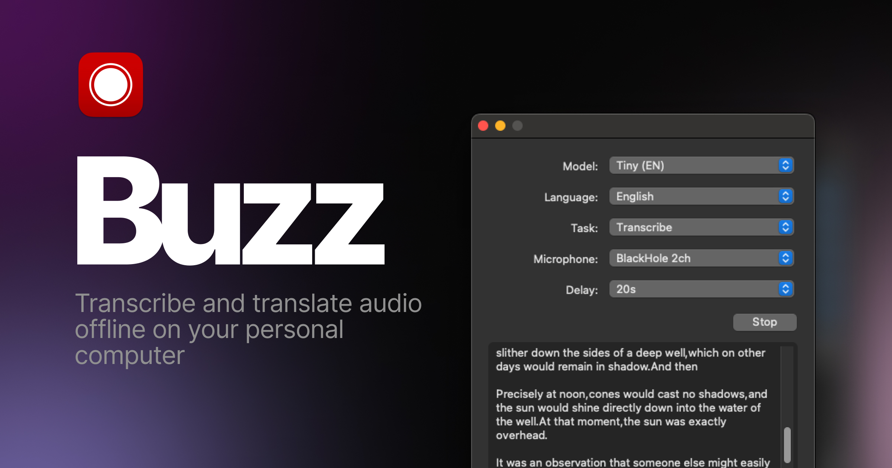

[[English](../README.md)] <- Click here to View the English page.

# Buzz

[项目文档](https://chidiwilliams.github.io/buzz/zh/docs) | [苹果应用商店的 Buzz Captions 页面](https://apps.apple.com/us/app/buzz-captions/id6446018936?mt=12&itsct=apps_box_badge&itscg=30200)

在个人电脑上离线转录和翻译音频。技术模型来源 OpenAI [Whisper](https://github.com/openai/whisper).


[](https://github.com/chidiwilliams/buzz/actions/workflows/ci.yml)
[](https://codecov.io/github/chidiwilliams/buzz)

[](https://GitHub.com/chidiwilliams/buzz/releases/)

<blockquote>
<p>在 App Store 下载运行的性能更佳。 获得外观更整洁、音频播放、拖放导入、转录编辑、搜索等功能的原生Mac版本。</p>
<a href="https://apps.apple.com/cn/app/buzz-captions/id6446018936?mt=12&amp;itsct=apps_box_badge&amp;itscg=30200"></a>
</blockquote>



## 安装

**PyPI**:

安装 [ffmpeg](https://www.ffmpeg.org/download.html)

安装 Buzz

```shell
pip install buzz-captions
python -m buzz
```

**macOS**:

使用 [brew utility](https://brew.sh/) 安装

```shell
brew install --cask buzz
```

或下载并运行在 [Releases ](https://github.com/chidiwilliams/buzz/releases/latest) 页面中的 `.dmg` 文件 .

**Windows**:

下载并运行在 [Releases ](https://github.com/chidiwilliams/buzz/releases/latest) 页面中的 `.exe` 文件。

应用程序未获得签名，当安装时会收到警告弹窗。 选择 `更多信息` -> `仍然运行`.

**Linux**:

```shell
sudo apt-get install libportaudio2 libcanberra-gtk-module libcanberra-gtk3-module
sudo snap install buzz
sudo snap connect buzz:password-manager-service
```

### 最新开发者版本

有关如何获取具有最新功能和错误修复的最新开发版本的信息，请查阅 [FAQ](https://chidiwilliams.github.io/buzz/docs/faq#9-where-can-i-get-latest-development-version).
